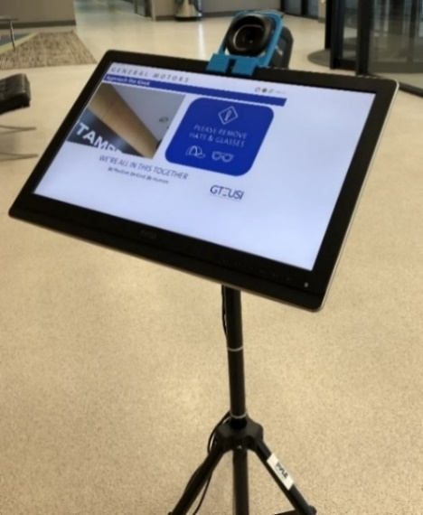
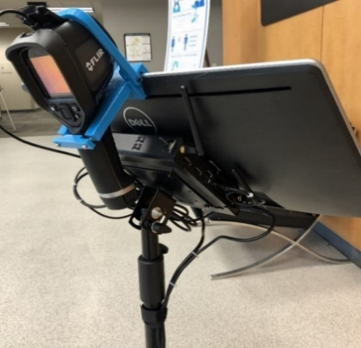
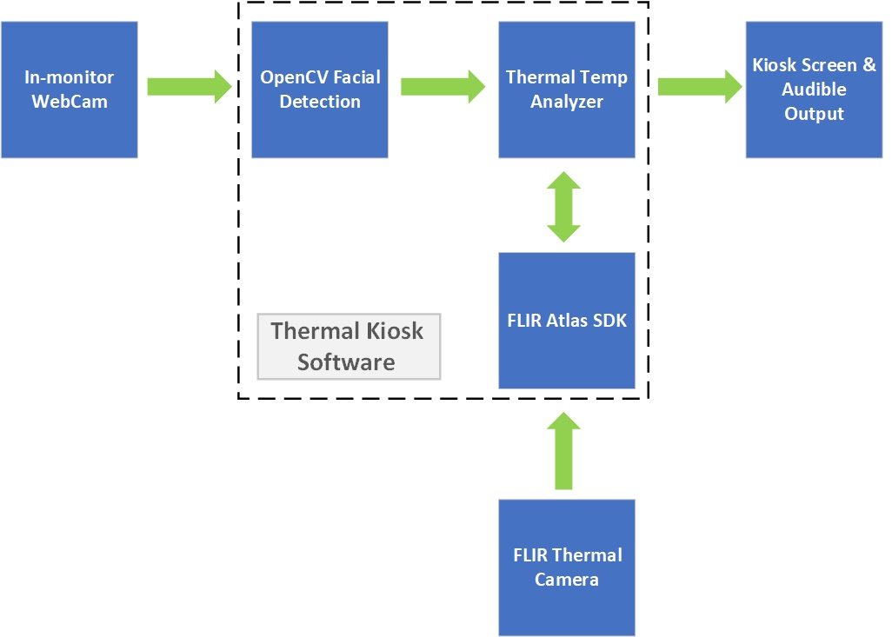
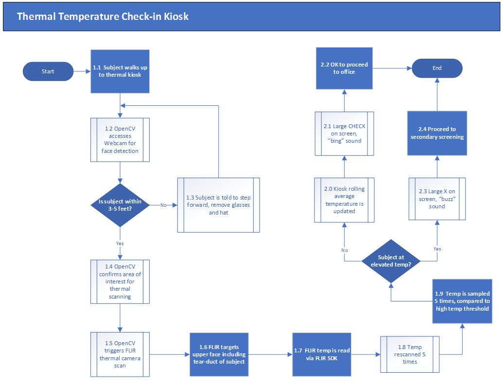
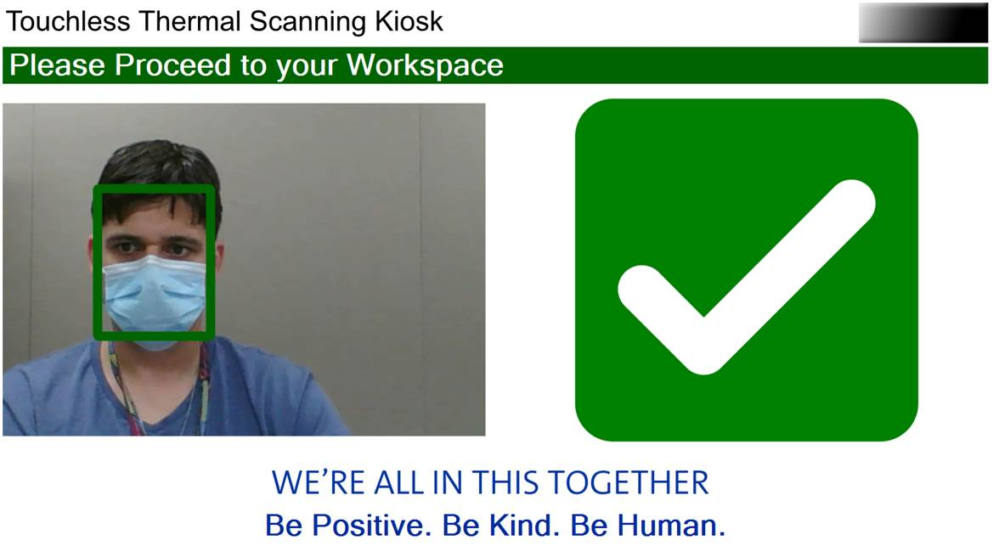
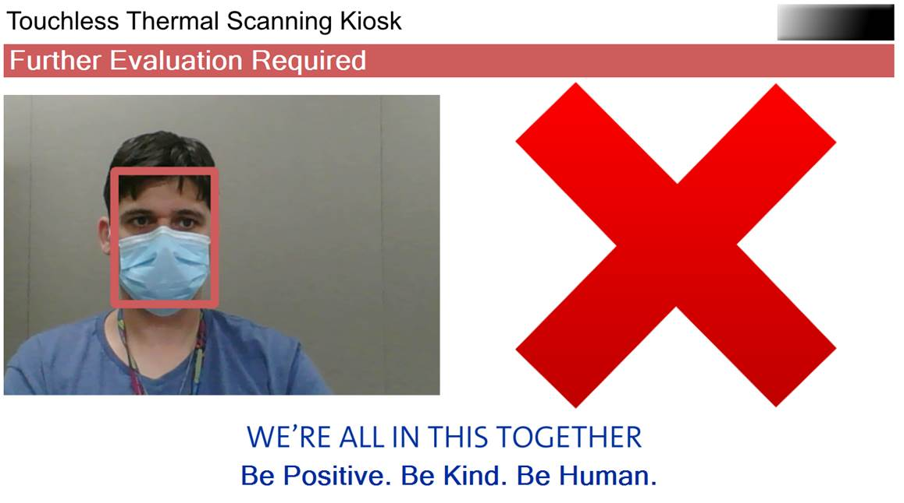
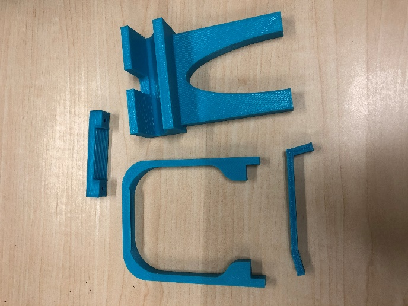
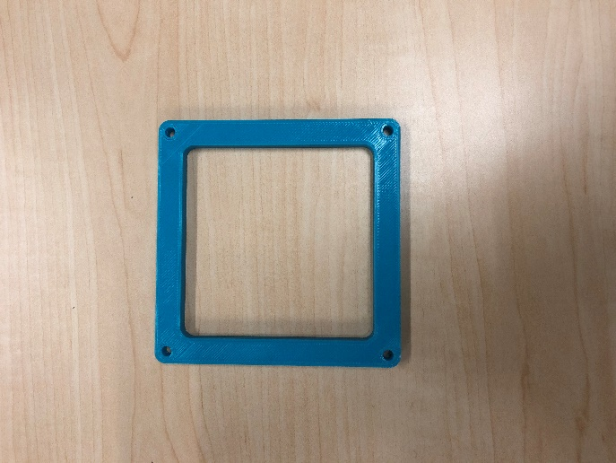
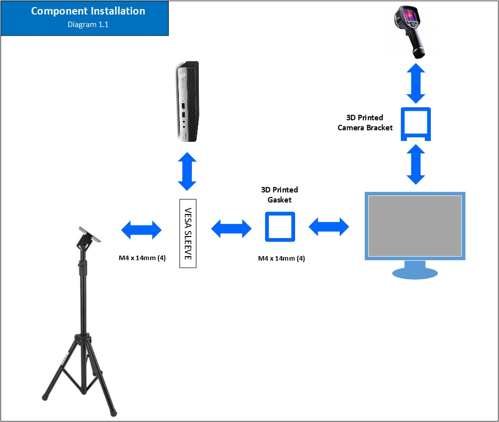
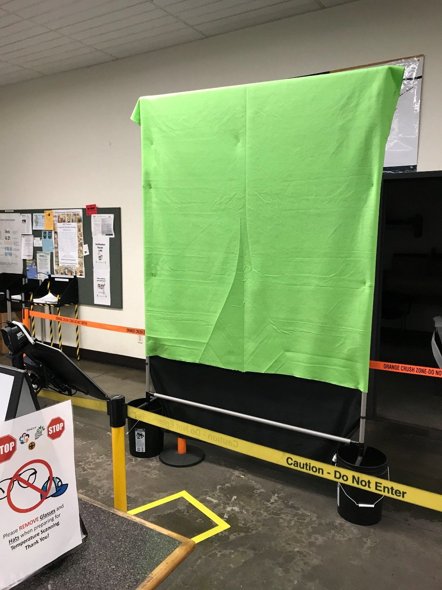

## title: Thermal Scanning Kiosk

# Overview and Context

In this paper, we present a low-cost thermal scanning kiosk for identifying
higher temperature individuals entering a facility. The kiosk offers
conveniences, such as auto-start and auto-reset, which eliminates the need for a
user to touch the kiosk.

This kiosk is not intended to measure actual temperature nor is it for the
diagnosis of any medical condition such as COVID-19 or any other disease. It
does not determine if the user has a fever nor does it provide the user with
their temperature. Rather, the device works by comparing thermal readings from a
current user with an average of readings from prior users. If the present user’s
reading is a certain amount away from the average, the user is presented with a
display recommending further evaluation. To determine whether someone may be
febrile, your facility then must make provisions to take body temperature
measurements with an appropriate evaluation method such as a non-contact
infrared thermometer or a clinical grade contact thermometer.

This kiosk is designed to use the FLIR E8-XT model infrared camera from FLIR®
Systems, Inc. Along with this document, we provide two versions of software that
incorporate FLIR software: a compiled, ready-to-use version and a source code
version. The ready-to-use version requires acceptance of FLIR’s software license
terms. The source code version references FLIR’s SDK which requires accepting
FLIR’s terms of use. We also provide plans for 3D printing parts used in
construction of the kiosk to hold the E8-XT camera in place.

Licenses for use of the intellectual property we provide are included. These
licenses place certain restrictions on the use of this intellectual property
including that this intellectual property can only be used in a kiosk of the
type described here and that this intellectual property may not be used for
commercial purposes. In other words, you cannot use this intellectual property
to market or sell a kiosk or to manufacture a kiosk for third parties.

This document provides a description of what you need to get this kiosk up and
running. Simplicity, portability, and cost were goals for this effort. We hope
that it will not only be used by the community at large but that it will be
improved upon by others.

# Capabilities

The kiosk provides the following capabilities:

-   A physical kiosk comprised of a height-adjustable stand, VESA-mountable LCD
    screen with built in web camera and speakers, Windows PC, infrared camera,
    USB hub and power connections

-   Efficient evaluation which averages as little as 1 to 3 seconds per user

-   Thermal evaluation based on an automatic rolling temperature that can
    account for ambient changes over time

-   An Area of Interest for thermal temperature measurement is automatically
    identified and set to upper face and head including the tear ducts and
    forehead. Facial detection initiates automatic evaluation function when a
    person steps up to the unit

-   Automatic distance compensation to accommodate distance range of 2 ft to 4.5
    ft from the camera for consistent measurements

-   Automatic completion of kiosk flow when a person steps away from the unit

-   Facial detection will work with face mask either on or off

-   On-screen notification to remind the user to remove a hat or glasses

-   Measured temperature is not displayed to each user and instead the user sees
    only a PASS/FAIL result

# Bill of Materials

The following components are used to build the kiosk and are referenced in the
architecture and implementation sections that follow.

| **Component Description**                | **Qty** | **Approx. Cost** |
|------------------------------------------|---------|------------------|
| FLIR E8-XT Thermal Camera                | 1       | \$3,000          |
| HP ProDesk 400 G5 Mini (1 HDMI port)     | 1       | \$510            |
| HP V2 Mounting Kit (Mini Desktop)        | 1       | \$35             |
| Dell 21.5” Monitor (UZ2215Hf)            | 1       | \$140            |
| HDMI 1.5 ft cable                        | 1       | \$7              |
| Pyle VESA Flat Screen Tripod (100 x 100) | 1       | \$40             |
| USB A/B Cable 1.5ft (to screen)          | 1       | \$6              |
| USB A/Micro USB Cable 1.5ft (to camera)  | 1       | \$6              |
| 1" Cable Management Sticker              | 1       | \$0.25           |
| 4" Zip Tie                               | 8       | \$1              |
| 8" Zip Tie                               | 8       | \$1              |
| 11" Zip Tie                              | 8       | \$1              |
| 3D Printed Camera Bracket (4 parts)      | 1       | \$0              |
| 3D Printed Gasket                        | 1       | \$0              |
| M3 x 14mm screws                         | 7       | \$5              |
| M3 nuts                                  | 2       | \$0.25           |
| Inland USB 3.1 Hub                       | 1       | \$15             |
| Power strip (6 port)                     | 1       | \$10             |
| **Total Cost**                           |         | \$3,777.50       |

Architecture

The system uses OpenCV facial detection to start the evaluation process and
identify the location of the user’s face. Using this location, the system sets
the Area of Interest (AoI) to include the upper face and head which includes the
tear ducts and forehead. The system retrieves multiple thermal temperature
assessments for each user from the FLIR E8-XT via the FLIR Atlas SDK. The system
averages the individual user samples and compares the user's average against a
rolling average of the past 15 users.

# Flow

# Thermal Process Details

## Thermal Image Retrieval

OpenCV analyses the web camera video feed at 30 FPS to identify faces within an
acceptable distance range for evaluation. If the user is too far away,
instructions are displayed to prompt the user to move closer. If multiple users
are identified, instructions are displayed to indicate that only one person at a
time may use the system and the system will not initiate evaluation in this
condition. Once OpenCV establishes a qualified facial detection within the
specified distance range, the evaluation process will be triggered and the first
thermal base image will be retrieved from the FLIR E8-XT camera using the
FLIR.Atlas.Live library (FLIR Atlas SDK 5.0). If the user moves out of the frame
or out of the specified distance range during evaluation, the process will halt,
discard any completed sampling measurements, and reset the process such that the
user will need to re-establish a qualified facial detection to initiate
evaluation again from the beginning.

## Area of Interest

Upon qualified facial detection by OpenCV, coordinates of the user’s face are
established and a rectangle around the user’s face is identified. The rectangle
coordinates are processed to identify the Area of Interest (AoI) which targets
the user’s upper face and forehead while also avoiding gaps above and below the
user’s ears.

Image compensation is applied to the web camera image and the thermal image to
account for the physical offset and angle differences between the two cameras.
Angle distance compensation is applied to the image alignment to correct the
alignment over a user distance range between 2ft to 4.5ft.

The Area of Interest is calculated and applied to the thermal base image based
on a percentage of the OpenCV Facial Detection Rectangle in order to focus the
thermal evaluation on the user’s upper face and forehead. The following
configurable values in the app.config file determine the percentage for the Area
of Interest

*\<add key="irHeightAoI" value="0.65" /\>* -- *(Top 65% of the user’s face /
head)*  
*\<add key="irWidthAoI" value="0.9" /\>* -- *(90% centered width)*

## User Sampling and Averaging

While the user maintains a qualified facial detection, five (5) sequential
thermal base image samples are taken by the FLIR E8-XT infrared camera. The
thermal measurement is acquired from the thermal base image by using the
FLIR.Atlas.Image library (FLIR Atlas SDK 5.0) to locate the highest temperature
within the designated Area of Interest. Once the existing thermal base image is
processed, the highest temperature reading within the Area of Interest is stored
in memory and the thermal image is discarded. A new thermal image is then
retrieved using the FLIR.Atlas.Live library (FLIR Atlas SDK 5.0) and the Area of
Interest is re-calculated using the corresponding facial detection coordinates
from OpenCV. This compensates for the user’s movement throughout the evaluation
process. If the user moves out of the frame or out of the acceptable distance
range before the system completes all five samples, the process will reset,
existing samples will be discarded, and the user will need to establish a
qualified facial detection to re-start the evaluation process from the
beginning.

Once five (5) samples have been collected, the results are averaged to produce
the determinant thermal value for the user’s session. This value is compared to
the rolling baseline average of the past fifteen (15) users to determine the
pass / fail outcome of the current user’s session.

The number of required samples is configurable in the app.config file using the
following parameter:

*\<add key="requiredScanPasses" value="5" /\>* -- *(5 samples will be required
for each user)*

## Rolling Baseline Average

The baseline rolling average is determined by the average of the determinate
thermal outcomes (average of five (5) samples per user) for the previous fifteen
(15) successful evaluation sessions. Failed outcomes are excluded from the
rolling average calculation which prevents users with elevated temperatures from
artificially skewing the rolling average upwards.

The rolling baseline average is calculated by holding in memory the determinant
thermal result value for the previous fifteen (15) passing evaluation sessions.
When a new successful passing scan is completed, the oldest result is removed
from memory and the new result is committed to memory. The new rolling baseline
average is then calculated based upon the current fifteen values in memory.

The number of evaluation results to include in the rolling average is
configurable in the app.config file using the following parameter.

*\<add key="runningAvgUserCount" value="15" /\> -- (Average the most recent 15
evaluation results)*

## User Analysis

The determinant thermal value for the user’s session is compared to the Rolling
Baseline Average.

If the user’s determinant thermal value is within the defined variance from the
current rolling baseline average, then the user will receive a Pass notification
and user’s determinant thermal value will be used to update the Rolling Baseline
Average.

If the user’s determinant thermal value is NOT within the defined variance from
the current rolling baseline average, then the system will initiate a second
evaluation for the user which will collect a full set of five (5) additional
samples as defined by the *"requiredScanPasses"* parameter. If the second
evaluation also falls outside of the defined variance, then the user will
receive a Fail notification and the Rolling Baseline Average will not be
updated.

The defined variance is configurable in the app.config file using the following
parameters.

*\<add key="highTempThreshold" value="4.0" /\>* -- *(Allow 4 degrees F above the
rolling baseline average*)  
*\<add key="lowTempThreshold" value="6.0" /\>* -- *(Allow 6 degrees F below the
rolling baseline average)*

# Implementation

Instructions for assembling and setting up a kiosk are provided in the Thermal
Scanning Kiosk Installation and Setup Guide. Please have a USB keyboard and USB
mouse available for software download and setup. We recommend two people for the
assembly process. Safety glasses should be worn during preparation and assembly.

The kiosk uses 3D printed materials. Plans for these components are located at
https://github.com/generalmotors/thermal-scanning-kiosk/blob/master/3D-Printed-Parts/.
Commercial 3D printing services may be used to print these parts.

-   Suggested 3D Print Specs

    -   Material: PLA

    -   Layer Height: 0.3mm

    -   Wall Thickness: 1.2mm

    -   Top / Bottom Thickness: 1.2mm

    -   Infill: 25% to 30%

As shown below, four components on the left are used to make the camera bracket.
The part on the right is VESA gasket.

The physical cabling and basic hardware layout are generally illustrated in the
following two diagrams.

# Environmental Considerations

Below are steps that could help obtain accurate and consistent thermal
measurements from the kiosk.

-   Position the kiosk so that the camera is pointed away from outside windows
    and direct sunlight.

-   Locate the kiosk in an area with a consistent ambient temperature that is
    not influenced by temperature changes such as an external doorway. We do not
    recommend using the kiosk in a warehouse environment due to temperature
    inconsistencies.

-   The camera should be at room temperature. The E8 Manual states “For very
    accurate results, we recommend that you wait 5 minutes after you have
    started the camera before measuring a temperature.”

-   We recommend something behind the scanning area to block unwanted heat
    sources such as HVAC outlets, external windows or ceiling lights. This could
    be, for example, a wall or a backdrop.

    -   If you are using a backdrop, place the backdrop about 6 feet (2 meters)
        from the kiosk to allow a user to stand approximately 3-5 feet (1-1.5
        meters) away from the kiosk for evaluation.

    -   You can make a backdrop such as the one illustrated below. The frame is
        constructed of pipe or PVC that is anchored in 5 gallon weighted buckets
        (sand). The dimensions of the frame should exceed the kiosk’s field of
        view (this backdrop is about 8 feet by 8 feet). A colored piece of
        fabric may be placed over the frame and held in place with pins or
        clips. Make sure the backdrop is stable and not a trip hazard.

-   The scanning area should have enough light to ensure the contours of the
    scanned subject face are recognized. An external LED source can be added to
    provide additional light with a minimum of introduced heat.

# Compiled Software Distribution

A compiled distribution is available for simple setup and operation. This
version of the software will only work with a FLIR E8 camera. Custom code
modifications are not available with this option. However, logos and system
operating parameters may be edited as described in the Software Customization
Features section below.

The compiled distribution is provided as an .msi installation file, which is at
the following location:
<https://github.com/generalmotors/thermal-scanning-kiosk/blob/master/_distribution/ThermalScanningKiosk_setup.msi>.
This installation includes a setup wizard that will provide the full software
implementation. You will need to accept license terms during the installation.

The compiled distribution includes FLIR libraries which are licensed separately
by FLIR. Agreeing to the FLIR software license is required during installation
to proceed with the installation and to use the kiosk software with the FLIR
E8-XT camera.

# Source Code Package

The source code may be customized using an IDE for C\# .Net Windows Forms
applications. The source code is dependent on FLIR Libraries located in the
Atlas SDK Version 5.0. The FLIR SDK is licensed separately and may be retrieved
from FLIR. Instructions to obtain the FLIR SDK are available at
<https://flir.custhelp.com/app/answers/detail/a_id/1275>.

After completing the installation of the FLIR SDK, copy all library files into
the ThermalScanningKiosk project within the IDE. Ensure that all FLIR library
files are added to the project and set to copy to the output directory on
compile. The source code package already includes references and directives to
the FLIR Libraries, but the program will not compile and will not run properly
until the FLIR Libraries are included in the project and added to the output
directory on compile.

# Software Customization Features

The software has many customizable fields such as the custom audible alerts,
modifications to temperature thresholds and the number of scans. You can also
customize the messaging for pass/fail scenarios and bring in your own
organizational branding.

The configuration file can be found at

*...\\Program Files\\ThermalScanningKiosk\\ThermalScanningKiosk.exe.config*
under the \<appSettings\> header.

Customizable settings include the following:

-   **Audible Alerts** – The software uses the default Windows sounds. To add
    your own, ensure the file is in .wav format and add it to the HP ProDesk
    Mini. Edit the file location under the passSoundPath/failSoundPath in the
    config file for the file location.

-   **Threshold Adjustment** -- The default value is 4F / 6F as the temperature
    variance, this can be modified under the highTempThreshold/lowTempThreshold
    in the config file.

-   **Scans per user** -- The default value is 5 scans per user, this can be
    modified under the requiredScanPasses in the config file.

-   **Organizational branding on screen** -- Ensure the file is .jpg or .png
    format and add to the …\\ThermalScanningKiosk\\Graphics\\ folder. Be sure to
    update the file name in the config file.

-   **Rolling Average Temperature** -- The rolling average is based on the last
    15 scanned users. The number of users can be increased/decreased under the
    runningAvgUserCount in the config file.

# Terms of Use

By using this kiosk design and its associated software, you agree to the
following:

-   This kiosk design and its associated software may only be used for initial
    evaluation of multiple users entering a facility or other area.

-   This kiosk design and its associated software can only be used to examine
    one user at a time.

-   This kiosk design and its associated software will not be used to determine,
    diagnose or treat any disease or condition, including COVID-19.

-   This kiosk design and its associated software will not be used to determine
    if a user has a fever.

-   This kiosk design and its associated software will not be used to provide a
    user with their temperature, or any number related to their temperature.

-   This kiosk design and its associated software must notify a user when an
    elevated thermal measurement is determined and, if such a determination is
    made, that additional evaluation is required.

-   This kiosk design and its associated software can only be used in an
    environment where further evaluation is available using an appropriate
    method, such as measurement with a non-contact infrared thermometer or a
    clinical grade contact thermometer.

-   This kiosk design and its associated software cannot be used for a
    commercial purpose. This includes manufacturing a kiosk for a third party;
    marketing or selling a kiosk; requesting compensation for the use of a
    kiosk; renting or leasing a kiosk; and the like. This does not preclude you
    using the kiosk design and its associated software for internal use with
    employees, visitors, customers, students, and the like who may enter your
    facility.

-   FLIR requires that the use of this App with a FLIR EST Camera or approved
    FLIR Device is intended for use only as a skin temperature measuring tool,
    and is not a medically-approved body temperature measurement device or a
    medical diagnostic tool.

This kiosk relies on a third-party thermal infrared camera to provide readings
to the software. An appropriate camera must be selected and any instructions for
the camera followed for proper functioning of the kiosk. FLIR has indicated that
its E8 camera is generally suitable for skin temperature screening applications.

THIS KIOSK DESIGN AND ITS ASSOCIATED SOFTWARE ARE PROVIDED "AS IS", WITHOUT
WARRANTY OF ANY KIND, EXPRESS OR IMPLIED, INCLUDING BUT NOT LIMITED TO THE
WARRANTIES OF MERCHANTABILITY, FITNESS FOR A PARTICULAR PURPOSE, AND
NONINFRINGEMENT. IN NO EVENT SHALL THE AUTHORS OR COPYRIGHT HOLDERS BE LIABLE
FOR ANY CLAIM, DAMAGES, OR OTHER LIABILITY, WHETHER IN AN ACTION OF CONTRACT,
TORT OR OTHERWISE, ARISING FROM, OUT OF, OR IN CONNECTION WITH THE KIOSK,
SOFTWARE, OR THEIR USE.

# Acknowledgement

This thermal kiosk represents the hard work of some very passionate and
innovative people at General Motors. While many people contributed, we would
like to call out the core team specifically:

-   Spencer Searle

-   James Currie

-   Christopher Reeves

-   Naveen Sankar

-   Paerhati Remutula

-   Mike Schuplin

-   Peter Linton

-   Dan Rudman

-   Shane McCutchen

-   Peter Wyatt

-   Joe Gleason

# License

The software described in this paper is offered under licenses at
<https://github.com/generalmotors/thermal-scanning-kiosk/blob/master/LICENSE.txt>.

This documentation is licensed under a [Creative Commons
Attribution-NoDerivatives 4.0 International
License](https://creativecommons.org/licenses/by-nd/4.0/). 

Designs for the 3D-printed camera bracket and 3D-printed gasket described in
this documentation are licensed under a [Creative Commons Attribution-ShareAlike
4.0 International License](https://creativecommons.org/licenses/by-sa/4.0/).

Attribution: Copyright 2020 General Motors LLC
